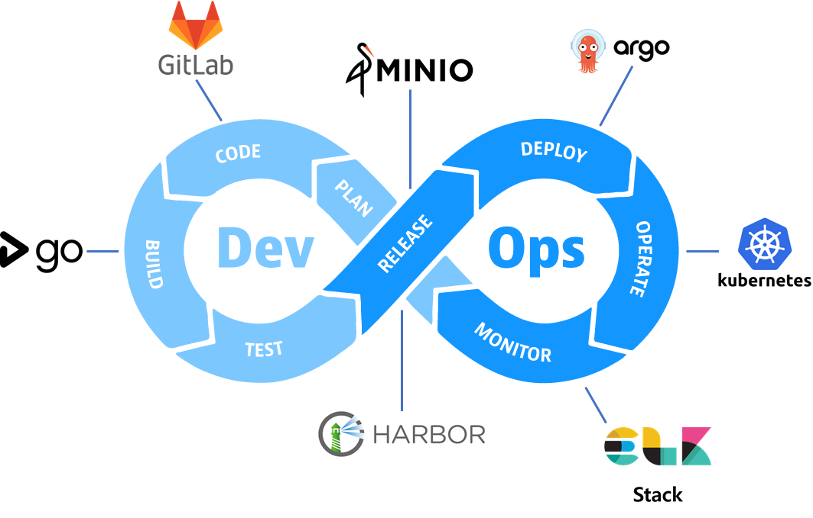
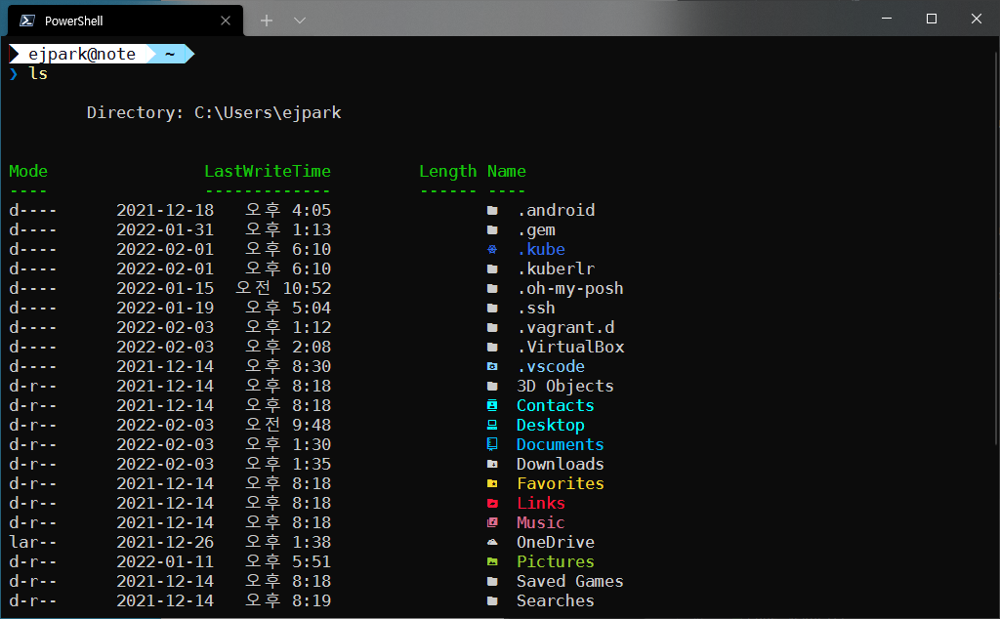

# DEPRECATED: move to [KANS](https://github.com/ejpark78/kans.git)

---

# My Devops Tools (Environments): with Kubernetes

쿠버네티스 환경에서 어플리케이션을 개발하고, 개발된 어플리케이션을 서비스하는 환경을 구축하는 방법에 관한 문서이다.
(2022년 KANS 1기 스터디(HTTP://KANS.CloudNeta.net) **중간 과제**로 작성한다. 이후 랩 스터디 자료로 사용할 예정이다.)



* Application Development Flow
  * 어플리케이션을 개발해서 gitlab 에 업로드 하면, goCD 가 코드를 받아서 도커 이미지로 빌드 한다. 
  * 빌드된 이미지를 harbor 에 푸시 하면 argoCD가 받아서 쿠버네티스에 배포 한다. 
  * 운영중 생기는 어플리케이션 로그는 Elasticsearch 에 저장 하고, 저장된 로그를 Kibana Dashboard 로 확인 한다.

※ OpenEBS 를 제외한 여러 조합으로 실험해 봤는데, (DB 와 같이) 상태가 있어야 하는 서비스는 docker 혹은 docker-compose 로 실행하고, 어플리케이션만 상태 없이 쿠버네티스로 실행한다.

## [사전 작업] Powershell + Windows terminal + Oh my posh + Nerd Fonts



1) windows terminal 설치

* https://docs.microsoft.com/en-us/windows/terminal/install 에서 터미널을 설치한다.

3) Oh my posh 설치 (Administrator)

```shell
Install-Module posh-git -Scope CurrentUser -Force
Install-Module oh-my-posh -Scope CurrentUser -Force
Install-Module -Name PSReadLine -Scope CurrentUser -Force -SkipPublisherCheck
Install-Module -Name Terminal-Icons -Repository PSGallery
```

4) Nerd Fonts 설치

* https://www.nerdfonts.com/ 에서 폰트를 다운로드해서 압축을 해제한다.
* 폰트를 설택후 마우스 오른쪽 클릭해서 '설치'를 선택한다.

5) windows terminal 폰트 변경

* 'Ctrl + ,' -> '프로필/기본값/모양/글꼴' -> 'DejaVuSansMono Nerd Font Mono' 선택 (4 에서 설치한 폰트 이름, 고정폭 폰트(Mono)를 선택한다.)

6-1) $PROFILE 생성 혹은 수정

```shell
code $PROFILE
```

6-2) 아래와 같이 설정

```shell
Set-Alias mpa multipass
Set-Alias vg vagrant
Set-Alias vbox VBoxManage

Import-Module posh-git
Import-Module oh-my-posh
Import-Module Terminal-Icons

Set-PSReadLineOption -PredictionSource History
Set-PoshPrompt -Theme paradox
```

## vagrant + kubernetes (1 master + 2 worker)

1) kubernetes 클러스터 생성

```powershell
cd vagrant\
vagrant up
```

2) virtualbox image 를 package 로 변환

```powershell
❯ VBoxManage list vms
"ubuntu-focal-20.04-cloudimg-20220104_1642837486794_58463" {63ed7399-f34c-4372-ae96-395e19ef7deb}
"master" {1a493330-770e-4ae0-9b43-22b25723144d}
"worker1" {9b95129a-fcb6-489c-9399-b831ae44a11c}
"worker2" {67af84d2-6c61-404b-b9c6-017d4fe8bd25}

vagrant package --base 1a493330-770e-4ae0-9b43-22b25723144d --output master.box
vagrant package --base 9b95129a-fcb6-489c-9399-b831ae44a11c --output worker1.box
vagrant package --base 67af84d2-6c61-404b-b9c6-017d4fe8bd25 --output worker2.box
```

## [kubernetes] network plugin

* flannel: https://github.com/flannel-io/flannel

```bash
kubectl apply -f https://raw.githubusercontent.com/flannel-io/flannel/master/Documentation/kube-flannel.yml
```

* calico: https://projectcalico.docs.tigera.io/
  * https://cwal.tistory.com/12

```bash
curl -O https://docs.projectcalico.org/manifests/calico.yaml
kubectl apply -f calico.yaml
```

* calico ctl

```bash
curl -L https://github.com/projectcalico/calico/releases/download/v3.22.0/calicoctl-linux-amd64 -o /usr/local/bin/calicoctl
chmod +x /usr/local/bin/calicoctl
```

* cilium

```bash
curl -LO https://github.com/cilium/cilium-cli/releases/latest/download/cilium-linux-amd64.tar.gz
tar xzvfC cilium-linux-amd64.tar.gz /usr/local/bin && rm cilium-linux-amd64.tar.gz

cilium install
```

## [kubernetes] metric server

metrics-server.yaml 파일에서 '--kubelet-insecure-tls'를 추가한다.

```bash
wget -O metrics-server.yaml https://github.com/kubernetes-sigs/metrics-server/releases/latest/download/components.yaml
sed -ire "/- --secure-port=4443/a\        - --kubelet-insecure-tls" metrics-server.yaml

kubectl apply -f metrics-server.yaml
```

## [kubernetes] ingress-controller

```bash
wget -O ingress-controller.yaml https://raw.githubusercontent.com/kubernetes/ingress-nginx/master/deploy/static/provider/baremetal/deploy.yaml

#ingress-controller.yaml 에서 LoadBancer 옵션으로 변경한다.

kubectl apply -f ingress-controller.yaml
```

## [docker] gitlab & gitlab-runner

1) gitlab 용 certs 생성

* https://docs.microsoft.com/ko-kr/azure/aks/ingress-own-tls
 
```bash
DNS_NAME=mydomain.com
openssl req -x509 -nodes -days 365 -newkey rsa:2048 \
    -subj "/CN=${DNS_NAME}/O=${DNS_NAME}-tls" \
    -out ${DNS_NAME}.crt -keyout ${DNS_NAME}.key

sudo mkdir -p /data/gitlab/config/ssl /data/gitlab-runner/config/certs

sudo cp ${DNS_NAME}.* /data/gitlab/config/ssl
sudo cp ${DNS_NAME}.* /data/gitlab-runner/config/certs
```

2) gitlab 실행 스크립트

* https://twoseed.atlassian.net/wiki/spaces/OPS/pages/551256065/GitLab+Docker+Engine+-+Ubuntu+18.04

```bash
cat <<EOS | tee gitlab.sh 
#!/usr/bin/env bash

DNS_NAME=mydomain.com
GITLAB_ROOT_PASSWORD=mypassword

docker stop gitlab
docker rm gitlab

docker run \\
  --detach --restart always \\
  --name gitlab \\
  --hostname gitlab \\
  --publish 80:80 \\
  --publish 443:443 \\
  --add-host ${DNS_NAME}:172.19.178.114 \\
  --env GITLAB_OMNIBUS_CONFIG="external_url 'https://${DNS_NAME}/'; gitlab_rails['lfs_enabled'] = true; letsencrypt['enable'] = false;" \\
  --env GITLAB_ROOT_PASSWORD="${GITLAB_ROOT_PASSWORD}" \\
  --env GITLAB_TIMEZONE="Asia/Seoul" \\
  --volume /data/gitlab/config:/etc/gitlab \\
  --volume /data/gitlab/logs:/var/log/gitlab \\
  --volume /data/gitlab/data:/var/opt/gitlab \\
  gitlab/gitlab-ce:14.7.3-ce.0

docker logs -f gitlab
EOS

chmod +x gitlab.sh

docker exec -it gitlab /bin/bash
```

3-1) gitlab-runner 실행 스크립트 생성

```bash
cat <<EOS | tee gitlab-runner.sh 
#!/usr/bin/env bash

DNS_NAME=mydomain.com

docker stop gitlab-runner
docker rm gitlab-runner

docker run \\
    --detach --restart unless-stopped \\
    --name gitlab-runner \\
    --hostname gitlab-runner \\
    --privileged \\
    --network host \\
    --add-host mirror.kakao.com:113.29.189.165 \\
    --add-host registry.npmjs.org:104.16.23.35 \\
    --add-host ${DNS_NAME}:172.0.0.10 \\
    --volume /var/run/docker.sock:/var/run/docker.sock \\
    --volume /data/gitlab-runner/config:/etc/gitlab-runner \\
    gitlab/gitlab-runner:latest

docker logs -f gitlab-runner
EOS

chmod +x gitlab-runner.sh
```

3-2) gitlab-runner register (with docker sock)

* https://gitlab.com/gitlab-org/gitlab-runner/-/issues/3748

```bash
DNS_NAME=mydomain.com
REG_TOKEN=$(awk --volume cmd='openssl x509 -noout -subject' '/BEGIN/{close(cmd)};{print | cmd}' < /etc/ssl/certs/ca-certificates.crt)

docker exec -it gitlab-runner \
  gitlab-runner register \
    --non-interactive \
    --name runner \
    --url https://${DNS_NAME} \
    --registration-token ${REG_TOKEN} \
    --executor "docker" \
    --docker-image alpine:latest \
    --run-untagged \
    --locked="false" \
    --docker-privileged \
    --docker-pull-policy if-not-present \
    --docker-network-mode host \
    --docker-extra-hosts mirror.kakao.com:113.29.189.165 \
    --docker-extra-hosts registry.npmjs.org:104.16.23.35 \
    --add-host ${DNS_NAME}:172.0.0.10 \
    --docker-network-mode host \
    --docker-volumes '/var/run/docker.sock:/var/run/docker.sock'
```

## [docker-compose] harbor

* [[DevOps] Docker-Compose를 이용해 Harbor 배포하기(HTTPS 지원)](https://wookiist.dev/126)
* [Deploy Harbor with the Quick Installation Script](https://goharbor.io/docs/2.0.0/install-config/quick-install-script/)

0) install docker compose 설치 

* [docker/compose/releases](https://github.com/docker/compose/releases)

```bash
wget -O /usr/local/bin/docker-compose "https://github.com/docker/compose/releases/download/v2.2.3/docker-compose-linux-x86_64"
sudo chmod +x /usr/local/bin/docker-compose

docker-compose version
```

1) harbor 용 certs 생성: mydomain.com 인증서 생성

```bash
DNS_NAME=mydomain.com
openssl req -x509 -nodes -days 365 -newkey rsa:2048 \
    -subj "/CN=${DNS_NAME}/O=${DNS_NAME}-tls" \
    -out ${DNS_NAME}.crt -keyout ${DNS_NAME}.key

sudo mkdir -p /data/harbor/certs

sudo mv ${DNS_NAME}.* /data/harbor/certs/
```

2) harbor repo 다운로드 

* https://goharbor.io/docs/2.0.0/install-config/
* [harbor/releases](https://github.com/goharbor/harbor/releases)
* [harbor 설치 부터 kubernetes 연동까지! – lahuman](https://lahuman.github.io/kubernetes-harbor/)

> download release file: harbor-offline-installer-v1.10.10.tgz

3) harbor config 설정 (v1.10.10 기준)
 
* harbor.yml

> hostname: harbor 도메인 주소
> 
> harbor_admin_password: admin 패스워드
> 
> data_volume: docker image 저장 위치

```yaml
# Configuration file of Harbor

# The IP address or hostname to access admin UI and registry service.
# DO NOT use localhost or 127.0.0.1, because Harbor needs to be accessed by external clients.
hostname: mydomain.com

# https related config
https:
  # https port for harbor, default is 443
  port: 5000
  # The path of cert and key files for nginx
  certificate: /data/harbor/certs/mydomain.com.crt
  private_key: /data/harbor/certs/mydomain.com.key

harbor_admin_password: mypassword

# Harbor DB configuration
database:
  # The password for the root user of Harbor DB. Change this before any production use.
  password: mypassword

# The default data volume
data_volume: /data/harbor
```

4) harbor 설치

```bash
sudo ./install.sh
```

5) kubernetes 용 docker pull secret 생성 방법

* kubernetes Secret을 생성하는 여러 방법이 있으나, 에러 나는 경우가 많다. 계정을 robot secret 으로 생성하는 경우 아이디가 robot$ 로 시작하는데, 이때 $가 말성을 부린다. 그래서 docker login 후 ~/.docker/config.json 파일을 kubernetes Secret 으로 생성한다.

```bash
❯ docker login mydomain.com:5000
Username: admin
Password: **********
WARNING! Your password will be stored unencrypted in ~/.docker/config.json.

Login Succeeded

❯ kubectl create secret generic harbor-secret \
    --from-file=.dockerconfigjson=~/.docker/config.json \
    --type=kubernetes.io/dockerconfigjson
    
❯ kubectl get secret/harbor-secret --output=yaml > helm/template/Secret.yaml

❯ kubectl delete secret/harbor-secret
```

## [docker] minio & minio client

minio 는 metadata 혹은 artifact 와 같이 용량이 큰 바이너리 데이터를 저장하는 장소로 사용된다. Storage Class 를 사용할 수도 있지만 Minio 는 UI 및 mc 라는 client 가 잘되어 있고, 파이썬에서 코드 몇줄로 연동이 가능하다는 장점이 있다.

1) minio docker scripts 생성

```bash
cat <<EOS | tee minio.sh 
#!/usr/bin/env bash

docker stop minio
docker rm minio

docker run \\
  --detach --restart unless-stopped \\
  --name minio \\
  --hostname minio \\
  --publish 9001:80 \\
  --publish 9000:9000 \\
  --env "MINIO_ROOT_USER=admin" \\
  --env "MINIO_ROOT_PASSWORD=mypassword" \\
  --volume "/data/minio:/data:rw" \\
  --volume /etc/timezone:/etc/timezone:ro \\
  --volume /etc/localtime:/etc/localtime:ro \\
  minio/minio:latest \\
    server --address "0.0.0.0:9000" --console-address "0.0.0.0:80" /data

docker logs -f minio
EOS

chmod +x minio.sh
```

2) minio client 설치

```bash
wget -O /usr/local/bin/mc "https://dl.min.io/client/mc/release/linux-amd64/mc" 
sudo chmod +x /usr/local/bin/mc

mc alias set wst http://mydomain.com:9000 admin mypassword
mc alias list
```

## [docker] goCD

* https://www.gocd.org/download/#docker
* https://hub.docker.com/r/gocd/gocd-server

```bash
GO_SERVER_URL=http://mydomain.com:8153

docker run --detach --restart unless-stopped -p 8153:8153 gocd/gocd-server:v21.4.0
docker run --detach --restart unless-stopped --env GO_SERVER_URL=${GO_SERVER_URL} gocd/gocd-agent-ubuntu-20.04:v21.4.0
```

## [kubernetes] argoCD

* https://www.arthurkoziel.com/setting-up-argocd-with-helm/

1) argo helm install

```bash
helm repo add argo-cd https://argoproj.github.io/argo-helm
helm dep update charts/argo-cd/
```

1-1) values.yaml
```yaml

```

1-2) install
```bash
helm install argo-cd charts/argo-cd/
```

2) web ui

```bash
kubectl port-forward svc/argo-cd-argocd-server 8080:443

# init admin password
kubectl get pods -l app.kubernetes.io/name=argocd-server -o name | cut -d'/' -f 2
```

## [docker] Elasticsearch + Kibana

0) hosts 파일 생성

```bash
cat <<EOF | tee hosts
elk-n1
elk-n2
elk-n3
EOF
```

2) docker image build

1-1) 노드간 ssl 통신을 위한 elastic-certificates 생성

* https://www.elastic.co/guide/en/elasticsearch/reference/current/configuring-tls.html
* https://www.elastic.co/guide/en/kibana/master/configuring-tls.html

```bash
docker run \
  -it --rm \
  --volume "$(pwd)/certs:/mnt:rw" \
  docker.elastic.co/elasticsearch/elasticsearch:7.17.0 \
    bin/elasticsearch-certutil ca \
    && bin/elasticsearch-certutil cert --ca elastic-stack-ca.p12 \
    && openssl pkcs12 -in elastic-certificates.p12 -cacerts -nokeys -out elasticsearch-ca.pem \
    && bin/elasticsearch-certutil ca --pem \
    && mv *.p12 *.pem /mnt/
```

2) elasticsearch

* https://logz.io/blog/language-analyzers-tokenizers-not-built-elasticsearch-where-find-them/
 
```bash
cat <<EOF | tee Dockerfile
FROM docker.elastic.co/elasticsearch/elasticsearch:7.17.0

RUN echo "analysis plugins: BASE_IMAGE " \
    && bin/elasticsearch-plugin install analysis-nori \
    && bin/elasticsearch-plugin install analysis-kuromoji \
    && bin/elasticsearch-plugin install analysis-smartcn \
    && bin/elasticsearch-plugin install analysis-icu

RUN echo "repository plugins" \
   && bin/elasticsearch-plugin install --batch repository-hdfs \
   && bin/elasticsearch-plugin install --batch repository-s3

ADD certs/* /usr/share/elasticsearch/config/certs/

RUN chown -R elasticsearch /usr/share/elasticsearch/config/certs/
EOF

docker build -t mydomain.com:5000/elk/elasticsearch:7.17.0 .
```

3) kibana

```bash
cat <<EOF | tee Dockerfile
FROM docker.elastic.co/kibana/kibana:7.17.0

ADD certs/* /usr/share/kibana/config/elasticsearchcerts/

USER root

RUN chown -R kibana /usr/share/kibana/config/elasticsearchcerts/

USER kibana
EOF

docker build -t mydomain.com:5000/elk/kibana:7.17.0 .
```

4) install elasticsearch

4-1) vm.max_map_count 설정

```bash
BATCH=set_vm_max_map_count.sh

cat <<EOF | tee ${BATCH}
sudo swapoff -a
echo vm.max_map_count=262144 | sudo tee -a /etc/sysctl.conf
sudo sysctl --system
EOF

cat nodes | xargs -I{} scp ${BATCH} {}: 
cat nodes | xargs -I{} ssh {} "bash ${BATCH}" 
```

4-2) docker image push

```bash
docker save mydomain.com:5000/elk/elasticsearch:7.17.0 | gzip - > elasticsearch-7.17.0.tar.gz

cat nodes | xargs -I{} scp elasticsearch-7.17.0.tar.gz {}:
cat nodes | xargs -I{} ssh {} "docker load < elasticsearch-7.17.0.tar.gz"
```

4-3) data path permission fix

```bash
cat nodes | xargs -I{} ssh {} "sudo mkdir -p /data/elasticsearch"
cat nodes | xargs -I{} ssh {} "sudo chown -R 1000:1000 /data/elasticsearch"
```

4-4) elasticsearch docker command

```bash
BATCH=start-elasticsearch.sh

cat <<EOF | tee ${BATCH}
#!/usr/bin/env bash

NODE_NAME="\$1"

CLS_NAME="crawler-dev"
CONTAINER_NAME="elasticsearch"
IMAGE="mydomain.com:5000/elk/elasticsearch:7.17.0"
ELASTIC_USERNAME="elastic"
ELASTIC_PASSWORD="mypassword"
ES_JAVA_OPTS="-Xms8g -Xmx8g"
SEED_HOSTS="elk-n1,elk-n2,elk-n3"
WHITELIST="mydomain.com:9200"
DATA_HOME="/data/elasticsearch"

docker run \\
  --detach --restart=unless-stopped \\
  --privileged \\
  --network host \\
  --ulimit "memlock=-1:-1" \\
  --name "\${CONTAINER_NAME}" \\
  --hostname "\${NODE_NAME}" \\
  --env "HOSTNAME=\${NODE_NAME}" \\
  --env "ELASTIC_USERNAME=\${ELASTIC_USERNAME}" \\
  --env "ELASTIC_PASSWORD=\${ELASTIC_PASSWORD}" \\
  --env "node.name=\${NODE_NAME}" \\
  --env "ES_JAVA_OPTS=\${ES_JAVA_OPTS}" \\
  --env "discovery.seed_hosts=\${SEED_HOSTS}" \\
  --env "discovery.zen.minimum_master_nodes=3" \\
  --env "cluster.name=\${CLS_NAME}" \\
  --env "cluster.publish.timeout=90s" \\
  --env "cluster.initial_master_nodes=\${SEED_HOSTS}" \\
  --env "transport.tcp.compress=true" \\
  --env "network.host=0.0.0.0" \\
  --env "node.master=true" \\
  --env "node.ingest=true" \\
  --env "node.data=true" \\
  --env "node.ml=false" \\
  --env "node.remote_cluster_client=true" \\
  --env "xpack.security.enabled=true" \\
  --env "xpack.security.http.ssl.enabled=true" \\
  --env "xpack.security.http.ssl.keystore.path=/usr/share/elasticsearch/config/certs/elastic-certificates.p12" \\
  --env "xpack.security.http.ssl.truststore.path=/usr/share/elasticsearch/config/certs/elastic-certificates.p12" \\
  --env "xpack.security.transport.ssl.enabled=true" \\
  --env "xpack.security.transport.ssl.verification_mode=certificate" \\
  --env "xpack.security.transport.ssl.keystore.path=/usr/share/elasticsearch/config/certs/elastic-certificates.p12" \\
  --env "xpack.security.transport.ssl.truststore.path=/usr/share/elasticsearch/config/certs/elastic-certificates.p12" \\
  --env "reindex.remote.whitelist=\${WHITELIST}" \\
  --volume "\${DATA_HOME}/snapshot:/snapshot:rw" \\
  --volume "\${DATA_HOME}/data:/usr/share/elasticsearch/data:rw" \\
  \${IMAGE}
EOF

cat nodes | xargs -I{} scp ${BATCH} {}:
cat nodes | xargs -I{} echo "ssh {} \"bash ${BATCH} {} ; docker ps\""
```

4-5) api test

```bash
❯ curl -k -u elastic:mypassword https://mydomain.com:9200/
```

5) kibana install

5-1) docker image pull & push

```bash
docker save mydomain.com:5000/elk/kibana:7.17.0 | gzip - > kibana-7.17.0.tar.gz

cat nodes | grep kibana | xargs -I{} scp kibana-7.17.0.tar.gz {}:
cat nodes | grep kibana | xargs -I{} ssh {} "docker load < kibana-7.17.0.tar.gz"
```

5-2) kibana 암호 설정

```bash
curl -k -u elastic:mypassword -H 'Content-Type: application/json' -d '{"password": "mypassword#"}' \
  https://mydomain.com:9200/_security/user/kibana_system/_password 
```

5-3) start kibana

```bash
BATCH=start-kibana.sh

cat <<EOF | tee ${BATCH}
#!/usr/bin/env bash

CONTAINER_NAME="kibana"
ELASTICSEARCH_USERNAME="kibana_system"
ELASTICSEARCH_PASSWORD="mypassword"
ELASTICSEARCH_HOSTS="https://mydomain.com:9200"
IMAGE="mydomain.com:5000/elk/kibana:7.17.0"

docker run \\
  --detach --restart=unless-stopped \\
  --name "\${CONTAINER_NAME}" \\
  --hostname "\${CONTAINER_NAME}" \\
  --network host \\
  --add-host "mydomain.com:172.0.0.10" \\
  --env "SERVER_HOST=0.0.0.0" \\
  --env "ELASTICSEARCH_HOSTS=\${ELASTICSEARCH_HOSTS}" \\
  --env "ELASTICSEARCH_USERNAME=\${ELASTICSEARCH_USERNAME}" \\
  --env "ELASTICSEARCH_PASSWORD=\${ELASTICSEARCH_PASSWORD}" \\
  --env "MONITORING_ENABLED=true" \\
  --env "NODE_OPTIONS=--max-old-space-size=1800" \\
  --env "ELASTICSEARCH_SSL_ENABLED=true" \\
  --env "ELASTICSEARCH_SSL_VERIFICATIONMODE=certificate" \\
  --env "ELASTICSEARCH_SSL_KEYSTORE_PATH=/usr/share/kibana/config/elasticsearchcerts/elastic-certificates.p12" \\
  --env "ELASTICSEARCH_SSL_KEYSTORE_PASSWORD=\"\"" \\
  --env "SERVER_SSL_ENABLED=true" \\
  --env "SERVER_SSL_KEYSTORE_PATH=/usr/share/kibana/config/elasticsearchcerts/elastic-certificates.p12" \\
  --env "SERVER_SSL_KEYSTORE_PASSWORD=\"\"" \\
  \${IMAGE}
EOF

cat nodes | grep kibana | xargs -I{} scp ${BATCH} {}:
```
